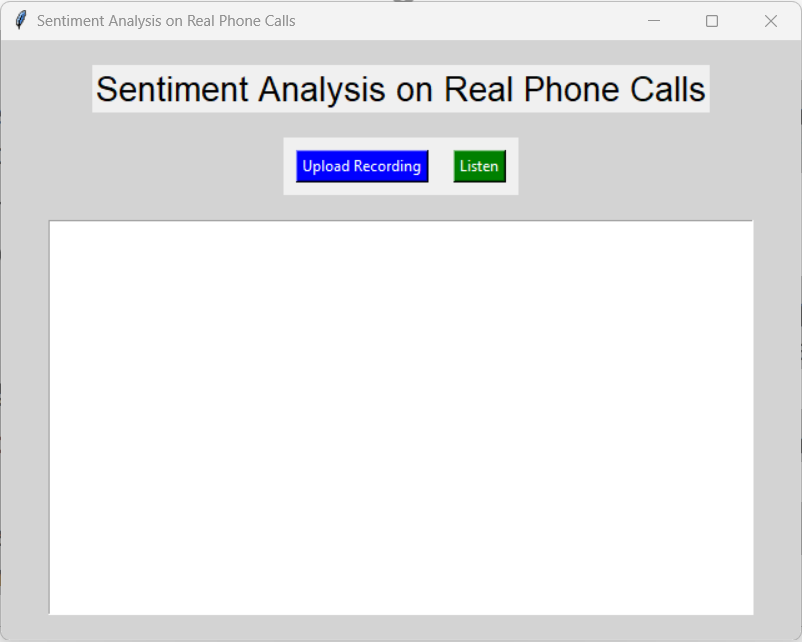
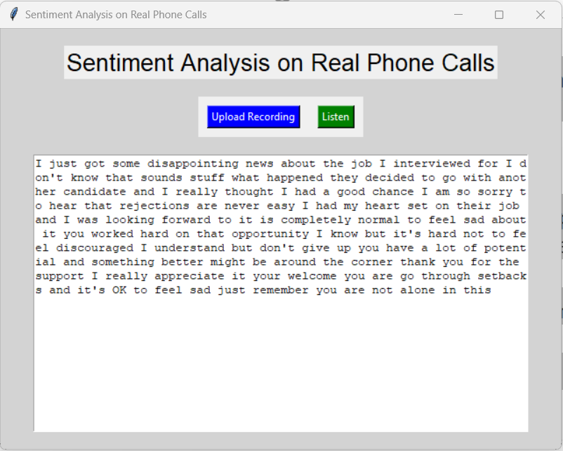
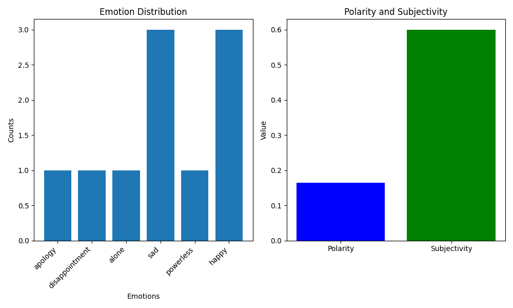
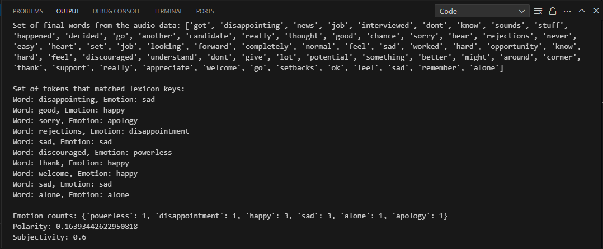

# Sentiment Analysis on Real Phone Calls

 Sentiment Analysis on a Real Phone Calls using Natural Language Processing(NLP)


## Overview
Sentiment Analysis on Real Phone Calls is a project designed to analyze and interpret the sentiment expressed in spoken language from phone call conversations. This tool helps businesses understand the emotions and sentiments of their customers by analyzing phone call data. Leveraging advancements in machine learning and natural language processing, the system provides valuable insights into customer satisfaction, market trends, and more.


## Features

- **Speech Recognition**: Converts spoken language from phone calls into text.
- **Text Preprocessing**: Cleans and prepares transcribed text for sentiment analysis.
- **Sentiment Analysis**: Uses lexicon-based methods to identify emotions and sentiments.
- **Visualization**: Generates visual representations of sentiment analysis results, including emotion distribution, polarity, and subjectivity.
- **User Interface**: Provides a user-friendly interface for uploading recordings or using the microphone for real-time analysis.


## Requirements

- **Python 3**: Ensure Python 3 is installed on your system.
- **Libraries**: The following Python libraries are required:
  - `tkinter`: For creating the graphical user interface.
  - `speech_recognition`: For converting speech to text.
  - `pyaudio`: For capturing audio data from the microphone.
  - `matplotlib`: For visualizing sentiment analysis results.
  - `numpy` (optional but recommended for some operations).
## Installation

### Step 1: Clone the Repository:

```bash
git clone https://github.com/Lucky9451/Sentiment-Analysis-on-Real-Phone-Calls.git
cd Sentiment-Analysis-on-Real-Phone-Calls
```

### Step 2: Install Required Libraries:

You can install the required Python libraries using pip:
```bash
pip install tkinter speech_recognition pyaudio matplotlib numpy
```
## Usage

1. **Run the Application**: 
To start the application, run the main.py script:
```bash
python main.py
```
2. **Upload a Recording**:
- Click on the "Upload Recording" button to select a WAV file for analysis.
- The transcribed text and sentiment analysis results will be displayed in the GUI.
3. **Use Microphone:**:
- Click on the "Listen" button to record audio from your microphone.
- The recorded audio will be transcribed and analyzed in real-time.
## Screenshots

#### RESULT OF PYTHON PROJECT

1. **Main GUI:** 
  The main graphical user interface of the application, featuring buttons for uploading recordings or using the microphone, and a text display area for showing transcribed text.
   - 

2. **Transcribed Text:** 
The transcribed text from a phone call, is displayed in the text area of the application. This text is prepared for sentiment analysis.
   - 

3. **Emotion Distribution with Polarity & Subjectivity**: 
- **Emotion Distribution:** A bar graph showing the distribution of different emotions detected in the transcribed text. This visualization helps in understanding the frequency of each emotion.
- **Polarity & Subjectivity:** A bar graph representing the polarity and subjectivity of the text. Polarity indicates the sentiment orientation, while subjectivity reflects the degree of opinion expressed.
- 

4. **Terminal Output**: 
This screenshot showcases the terminal output of the sentiment analysis process. It displays the following details:
- **Set of Final Words**: A list of words extracted from the audio data after preprocessing. These words form the basis for sentiment analysis.
- **Tokens Matched with Lexicon Keys**: Words from the final list that correspond to predefined emotions in the sentiment lexicon. Each matched word is associated with an emotion such as 'happy,' 'sad,' or 'apology.'
- **Emotion Counts**: A count of occurrences for each identified emotion, providing insight into the emotional tone of the conversation.
- **Polarity and Subjectivity**: Calculated metrics summarizing the sentiment. Polarity reflects the overall sentiment orientation (positive or negative), while subjectivity measures the degree of personal opinion versus factual content.

This information helps in understanding the sentiment expressed in the phone call and provides a quantitative summary of the emotions detected.
   - 

## Documentation

See the [Documentation](https://drive.google.com/file/d/1vyeodnpzcMEisArf6NIEbN27_IWG1_7V/view?usp=sharing).


## Authors

- [Lucky Verma](https://github.com/Lucky9451)

